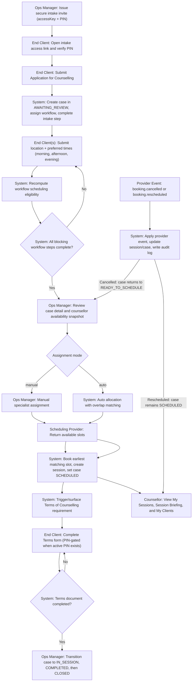

# Case Workflow + Scheduling Provider MVP

This app is the workflow/operations brain for a counselling service.

- Cases are created from intake submissions.
- Each case is assigned a counselling workflow template.
- Scheduling is provider-driven (`manual` deterministic engine now, with `calcom` and `microsoft_bookings` options) and blocked until required workflow steps are complete.
- Assignment mode is configurable (manual ops assignment or auto allocation).
- Terms of Counselling is issued after booking and must be completed before moving a case into `IN_SESSION`.
- Intake is a secure, non-public "Application for Counselling" multi-step JotForm-aligned flow with safeguarding checks, signature capture, and time-of-day preference capture (`morning`, `afternoon`, `evening`).
- PIN-gated secure forms are supported for time-sensitive controlled access.

## Architecture Contract

- App owns: case lifecycle, workflow compliance, assignment, and audit logs.
- Scheduling provider owns: booking slot truth and booking creation.
- The app must not schedule if workflow blocking steps are incomplete.

## Administrative Settings

Ops can update operational defaults without code changes under `/admin/settings`.

Exposed runtime settings:

- Scheduling engine type (`manual`, `calcom`, `microsoft_bookings`)
- Scheduling assignment mode (`manual` or `auto`)
- Default individual session length
- Default couples session length
- Workflow gate toggles
  - require Terms before `IN_SESSION`
  - require Outtake before `CLOSED`
- Manual-engine simulation policy
  - slot horizon (days)
  - slot increment (minutes)
  - morning/afternoon window start/end hours
- Form PIN default expiry and max attempts
- Intake invite default expiry and max attempts
- PIN access session length (cookie/session cutoff)

## Workflow Engine

Implemented models:

- `CaseWorkflowTemplate`
  - `counsellingType`
  - ordered `steps`
- `CaseWorkflowStep`
  - `name`
  - `type` (`FORM` | `REVIEW` | `SYSTEM`)
  - `required`
  - `blocksScheduling`
  - optional `formType` key for external form mapping
- `CaseWorkflowState`
  - `caseId`
  - `stepId`
  - `status` (`PENDING` | `COMPLETED`)
  - `metadata`

When a case is created, the system selects an active `CaseWorkflowTemplate` for the counselling type and initializes `CaseWorkflowState` rows.

## Scheduling Provider

`src/lib/scheduling/types.ts`

```ts
interface SchedulingProvider {
  getAvailableSlots(specialistId, eventType, durationMinutes): Promise<Date[]>;
  createBooking(specialistId, startTime, caseData): Promise<BookingResult>;
  cancelBooking(bookingId): Promise<void>;
}
```

Provider implementations:

- Manual engine (deterministic simulation) via `ManualSchedulingProvider` (`src/lib/scheduling/manual-provider.ts`)
- `CalcomSchedulingProvider` placeholder (`src/lib/scheduling/calcom-provider.ts`)
- `MicrosoftBookingsSchedulingProvider` placeholder (`src/lib/scheduling/microsoft-bookings-provider.ts`)

Factory:

- `src/lib/scheduling/index.ts`
- settings switch: `/admin/settings/operations` -> Scheduling engine
- env fallback: `SCHEDULING_ENGINE` or legacy `SCHEDULING_PROVIDER`

Assignment mode switch:

- `src/lib/scheduling/config.ts`
- env switch: `SCHEDULING_ASSIGNMENT_MODE=manual|auto`
- default: `manual`

Mode behavior:

- `manual` (MVP default): intake stores time-of-day preferences and ops assigns specialists manually.
- `auto`: availability-window overlap matching is enforced and auto-allocation can be run.

External provider compatibility:

- Availability and booking are provider-owned and can come from external APIs.
- The app normalizes provider responses into internal booking/session records.
- Workflow and allocation logic are provider-agnostic; changing provider should only require a new adapter implementing `SchedulingProvider`.
- This supports Cal.com or alternatives (for example Microsoft Bookings) without changing case lifecycle logic.

Public availability endpoint:

- `GET /api/public-availability`
- Returns provider-derived slot options for the intake availability widget.
- Request supports `counsellingType`, optional `durationMinutes`, `location`, and `includeOnline`.

## Scheduling Gate (Required Rule)

Scheduling is rejected unless all required blocking workflow steps are completed.

- Service-layer enforcement in case allocation/override (`src/lib/case-service.ts`).
- Rejection message: `Case not eligible for scheduling`.
- Availability policy lock-in in `auto` mode: `separate participant submissions with overlap required`.
  - Singles: one participant availability submission required.
  - Couples: each participant submits separately, and scheduling is only eligible when submitted windows overlap for the required session duration.
- In `manual` mode, assignments use intake time-of-day preferences (`morning`, `afternoon`, `evening`) instead of overlap windows.

## Form Ingestion Endpoint

Generic external form completion ingestion:

- `POST /forms/submission`

Payload supports:

- `formType`
- `participantIdentifier` (email/phone)
- optional identifiers: `caseId` or `caseReference`
- `answersMetadata`/`metadata`

Behavior:

1. Match submission to a case.
2. Match to workflow form step by `formType`.
3. Mark `CaseWorkflowState` as completed.
4. For mapped document forms (`TERMS_AND_CONDITIONS`, `INTAKE_FORM`, `OUTTAKE_FORM`), auto-complete matching `DocumentInstance` when present.
5. Re-evaluate and return scheduling eligibility.

For workflow steps marked as "both participants", participant completions are tracked in metadata and the step only completes once all participants submit.

Note: form files/documents are **not** stored by this endpoint. Only completion state + metadata are stored.

PIN gate behavior:

- If a valid active PIN exists for the same case + participant + `formType`, `/forms/submission` requires a verified PIN session (`accessKey` + cookie) before submission is accepted.
- This allows ops to throttle form access during high-demand periods.

Availability ingestion (separate endpoint):

- `POST /availability/submission`

Payload:

- `participantIdentifier`
- optional identifiers: `caseId` or `caseReference`
- `windows[]` with `startTime` and `endTime`
- optional: `timezone`, `metadata`, `source`

Behavior:

1. Match participant + case.
2. Replace that participant's active availability windows.
3. Recompute overlap across participants.
4. Update `AVAILABILITY_SUBMISSION` workflow step (`PENDING`/`COMPLETED`).
5. Return current scheduling eligibility.

## Case Lifecycle

Case statuses:

1. `NEW`
2. `AWAITING_REVIEW`
3. `MATCHED`
4. `AGREEMENT_PENDING`
5. `READY_TO_SCHEDULE`
6. `SCHEDULED`
7. `IN_SESSION`
8. `COMPLETED`
9. `CLOSED`

Secure intake submissions create pending cases (`AWAITING_REVIEW`) and do not auto-schedule.

## Data Model Highlights

Core models:

- `Case`
- `CaseParticipant`
- `Specialist`
- `Session`
- `DocumentTemplate`
- `DocumentInstance`
- `AuditLog`
- `CaseWorkflowTemplate`
- `CaseWorkflowStep`
- `CaseWorkflowState`
- `CaseAvailabilityWindow`

Supporting models:

- `Client`
- `OperationsUser`
- `UserAccount`
- `AuthSession`
- `FormAccessPin`

## Local Run

1. Install and configure:

```bash
npm install
cp .env.example .env
```

2. Generate/push/seed:

```bash
npm run db:generate
npx prisma db push --force-reset
npm run db:seed
```

3. Start app:

```bash
npm run dev
```

4. Optional: enable auto allocation mode

```bash
SCHEDULING_ASSIGNMENT_MODE=auto npm run dev
```

## Demo Credentials

- Ops: `ops@demo.local / password123`
- Specialist: `avery.specialist@demo.local / password123`
- Specialist: `jordan.specialist@demo.local / password123`

## Local Seed Fixtures

After `npm run db:seed`, deterministic PIN links are created for quick manual testing.

- Secure intake invite
  - `Intake Prospect <intake.prospect@example.com>`
  - Access: `/intake/access/seed-intake-primary-2001` with PIN `778899`

- `CASE-1001` (`Taylor Ng`)
  - `TERMS_AND_CONDITIONS` -> `/forms/access/seed-terms-case-1001` with PIN `111111`
  - `OUTTAKE_FORM` -> `/forms/access/seed-outtake-case-1001` with PIN `222222`
- `CASE-1002` (`Chris Diaz`, `Robin Diaz`)
  - `CONSENT_FORM` (Chris) -> `/forms/access/seed-consent-case-1002-a` with PIN `333333`
  - `CONSENT_FORM` (Robin) -> `/forms/access/seed-consent-case-1002-b` with PIN `444444`
  - `AGREEMENT_FORM` (Chris) -> `/forms/access/seed-agreement-case-1002-a` with PIN `555555`

## Ops Screens

- `/admin/cases`
- `/admin/assignments` (Kanban drag/drop manual assignment board: unassigned -> specialist morning/afternoon/evening lanes)
- `/admin/cases/[id]` (lifecycle controls, manual override, and provider availability snapshot across all active counsellors)
- `/admin/clients`
- `/admin/specialists`
- `/admin/specialists/[id]`
- `/admin/workflows` (design templates/steps)
- `/admin/settings` (administrative settings hub)
- `/admin/settings/operations` (scheduling engine + mode, workflow gates, manual-engine simulation constants, and PIN policy defaults)
- `/admin/settings/intake` (edit crisis modal + availability guidance content)

Client-facing secure forms:

- `/intake`
- `/intake/access/[accessKey]` (intake PIN entry)
- `/forms/access/[accessKey]` (PIN entry)
- `/forms/terms-and-conditions` (PIN-protected form scaffold)
- `/forms/agreement` (PIN-protected form scaffold)
- `/forms/consent` (PIN-protected form scaffold)
- `/forms/outtake` (PIN-protected form scaffold)

Specialist:

- `/specialist/sessions`
- `/specialist/sessions/[id]`
- `/specialist/clients`

## API Surface

- `POST /api/intake`
- `POST /api/intake/access/issue`
- `POST /api/intake/access/verify`
- `GET /api/public-availability`
- `POST /api/forms/access/issue`
- `POST /api/forms/access/verify`
- `GET /api/forms/access/session`
- `POST /forms/submission`
- `POST /availability/submission`
- `POST /api/cases/:id/allocate`
- `POST /api/cases/:id/transition`
- `POST /api/cases/:id/override`
- `POST /api/documents/:id/complete`
- `POST /api/provider/events`
- `POST /dev/simulate-week`
- `POST /dev/create-test-cases`
- `POST /dev/provider/cancel/:bookingId`

## Example Flow (Counselling)

1. Ops issues a secure intake invite (access link + PIN) to the client email.
2. Client opens `/intake/access/:accessKey`, verifies PIN, and is redirected to `/intake?accessKey=...`.
3. Client submits intake form.
4. Case is created in pending review and assigned a workflow template.
5. External form completions are ingested via `/forms/submission`.
6. Clients submit location + notes + preferred times (`morning`, `afternoon`, `evening`) in intake.
7. Workflow remains blocked until required blocking steps are complete.
8. In manual mode, ops uses `/admin/assignments` to drag cases from `Unassigned` into specialist time blocks (`Morning`, `Afternoon`, `Evening`), and the system books the earliest matching 60-minute slot between `09:00` and `18:00`.
9. In auto mode, overlap-based allocation books the earliest eligible slot.
10. Terms of Counselling is sent after booking; case cannot transition to `IN_SESSION` until terms is completed.

## Persona Workflows

### End Client

1. Receive a secure intake invite from ops (`/intake/access/:accessKey` + PIN).
2. Verify PIN, then complete the multi-step "Application for Counselling" form.
3. Submit location, notes, and time-of-day preferences in the intake journey.
4. Receive confirmation that the case is in review and pending allocation.
5. Receive secure PIN-gated follow-up forms (for example Terms of Counselling) when issued by ops.
6. Complete Terms after booking; this is required before the case can progress to `IN_SESSION`.

### Ops Manager

1. Issue secure intake invites and PINs from the ops case area.
2. Review case details, workflow blockers, submitted forms, documents, and audit logs.
3. View provider availability across all active counsellors in case detail.
4. In manual mode (default), assign specialist manually; in auto mode, run auto allocation or manual override.
5. Transition case statuses through lifecycle stages when gate conditions are met.
6. Issue and disable PIN-gated form access links for participants.
7. Manage specialist profiles, capabilities, and provider mapping fields.

### Counsellor

1. See only assigned work in `My Sessions` and `My Clients`.
2. Open session briefing pages with participants, case notes, submitted documents, flags, and previous sessions.
3. Deliver counselling sessions according to scheduled bookings and case lifecycle state.

## System Flowchart (Mermaid)



## PIN-Gated Forms

1. Ops opens case detail and issues a PIN for a participant + `formType` + target form path.
2. In ops case detail, changing `formType` auto-populates the default `formPath` for that form.
3. System generates an `accessKey` (link identifier), numeric PIN, and expiry/max-attempt lock settings.
4. Email send includes both link (`/forms/access/:accessKey`) and PIN.
5. Client enters PIN on the secure access screen.
6. Verified session cookie is set and user is redirected to target form.
7. Submission endpoint enforces PIN session when an active PIN exists.
8. Ops can disable any active PIN from case detail; disabled links can no longer be verified.

## Secure Intake Access (Not Public)

- `/intake` without `accessKey` does not render the form; it shows a secure access notice.
- Intake access is granted through `/intake/access/:accessKey` + PIN verification.
- `/api/intake` requires a valid intake access session cookie and matching invite recipient identity.

Provider-originated booking events are ingested via `/api/provider/events`. Cancellation events mark the session cancelled and move the case back to `READY_TO_SCHEDULE`.

## End-to-End Tests

Run:

```bash
npm run test:e2e
```

`test:e2e` now performs an automatic Prisma reset + seed in Playwright global setup so scheduling tests remain deterministic across repeated local runs.

Current suite validates:

- intake-to-closure flow
- specialist profile edit
- role-scoped client dashboards
- PIN-gated form verification and secure submission enforcement
- Terms of Counselling form completion with declaration + signature metadata capture
- send form PIN form-path auto-sync by selected form type
- ops PIN disable/revoke flow and blocked re-verification
- PIN-gated consent form detail validation and submission
- one-to-one durations: `30/60/90`
- many-to-one durations: `30/60/90`
- scheduling gate blocks allocation until blocking workflow steps complete
- availability overlap gate blocks allocation until required participant submissions overlap
- booking clash prevention
- external provider cancellation returns case to `READY_TO_SCHEDULE`
- terms gating on status transition
