# End Client Flow

This document describes the complete flow experienced by an end client (the person seeking counselling) through the platform, from initial contact to case closure.

## High-Level Summary

```
Ops issues invite ─► PIN verification ─► Intake form ─► Case created (AWAITING_REVIEW)
                                                             │
                              ┌────────────────────────────────┘
                              ▼
                     Triage (admin + clinical review)
                              │
                     ┌────────┴────────┐
                     ▼                 ▼
                  Approved          Declined ──► Case closed
                     │
                     ▼
              ┌─ OPS RESPONSIBILITY ──────────────────────────────┐
              │                                                    │
              │  OPS proposes case to counsellor                   │
              │       │                                            │
              │       ├── Counsellor agrees ──► Client assigned    │
              │       └── Counsellor declines ──► Back to pool ◄──┤
              │                                    (OPS repropose) │
              │  OPS proposes session time                         │
              │       │                                            │
              │       ├── Counsellor accepts ──► Sent to client    │
              │       │       │                                    │
              │       │       ├── Client accepts + ToC ──► Done    │
              │       │       └── Client counter-proposes ◄────────┤
              │       │                        (cycle back)        │
              │       └── Counsellor declines ──► OPS reproposes   │
              └────────────────────────────────────────────────────┘
                              │
                              ▼
                     Counselling sessions
                              │
                              ▼
                     Outtake Form (PIN-gated, required before CLOSED)
```

---

## Detailed Flow

### 1. Receiving the Intake Invite

The client journey begins **off-platform**. An Ops Manager issues a secure intake invite from the admin dashboard, which generates:

- An **access key** (unique link identifier)
- A **6-digit PIN**
- An **expiry window** (default 72 hours, configurable)

The client receives an email containing:
- Link: `/intake/access/:accessKey`
- PIN code

**The intake form is NOT public.** Visiting `/intake` without an `accessKey` shows a "Secure Access Required" notice directing the user to use their emailed link.

### 2. PIN Verification (Intake)

**Route:** `/intake/access/[accessKey]`

```
Client opens link
       │
       ▼
┌──────────────────────┐
│  PIN Entry Screen    │
│  ─────────────────   │
│  "Enter the PIN      │
│   sent to you by     │
│   email"             │
│                      │
│  [______] PIN input  │
│  [Verify]            │
└──────────────────────┘
       │
       ▼
  API: POST /api/intake/access/verify
       │
       ├── Invalid PIN ──► increment attempt count, show error
       │                    (locked after max attempts, default 5)
       │
       ├── Expired/Revoked ──► show "PIN expired, contact team"
       │
       └── Valid PIN ──► set httpOnly session cookie
                         redirect to /intake?accessKey=...
```

**Security details:**
- PINs are SHA-256 hashed with a server secret before storage
- Session tokens use timing-safe comparison
- Cookie: `cg_intake_access_<accessKey>` (httpOnly, secure in production, SameSite=lax)
- Session expiry is the lesser of: PIN expiry or configurable session length

### 3. Multi-Step Intake Form

**Route:** `/intake?accessKey=...`

The intake form is a 3-step client-side wizard:

```
Step 1: Application          Step 2: Presenting Issue     Step 3: Availability
─────────────────────        ──────────────────────────    ────────────────────────
• First name                 • Presenting issue           • Time-of-day preferences
• Last name                    (multi-select checklist)     (morning/afternoon/evening)
• Email                      • Issue details (free text)  • Location preference
• Phone                      • Heard about us               (in-person / online /
• Date of birth                (dropdown)                    no preference)
• GP name & phone            • Safeguarding question:     • Availability windows
• Emergency contact            "Are you in crisis?"         (in auto mode only)
  name & phone                 ──► triggers Crisis        • Additional notes
• Address                       Support Modal
• Counselling type
  (individual / couples)
• Second participant
  details (if couples)
• Contact preferences
  (phone/voicemail/email)
• Signature capture
  (typed or drawn)
```

**Crisis Support Modal:** If the client answers "yes" to the safeguarding question, a modal appears with emergency contact numbers (Samaritans, Lifeline, etc.) before they can continue. The content is configurable by Ops under `/admin/settings/intake`.

**Submission:**
```
Client completes all 3 steps and clicks Submit
       │
       ▼
  API: POST /api/intake
       │
       ├── Validates intake access session cookie
       ├── Validates recipient email matches invite
       │
       ▼
  System creates:
  ├── Client record(s)
  ├── Case (status: AWAITING_REVIEW)
  ├── CaseParticipant link(s)
  ├── Workflow template assignment
  ├── CaseWorkflowState rows (one per step)
  ├── Intake workflow step marked COMPLETED
  ├── Availability windows (if auto mode)
  └── Audit log entry
       │
       ▼
  Redirect to /intake/success?case=CASE-XXXX&caseId=...
```

### 4. Intake Success Page

**Route:** `/intake/success`

Displays:
- Case reference number (e.g., `CASE-1001`)
- Confirmation message
- Warning about high demand / wait times
- Scheduling eligibility status (blocked or ready)
- Crisis support contact information
- Links to submit another intake or view case in ops portal

### 5. OPS Review & Assignment (Admin Responsibility)

After intake submission the case sits in the **unassigned pool** with status `AWAITING_REVIEW`. Everything from this point forward is driven by admin/OPS.

#### 5a. Triage

OPS performs triage on the submitted intake. There are two dimensions of triage:

| Type | Purpose |
|------|---------|
| **Admin triage** | Checks the form is complete, contact details are valid, no duplicates |
| **Clinical triage** | Reviews the presenting issue, flags safeguarding concerns, assesses suitability |

**Triage outcomes:**
- **Approved** — case moves to `MATCHED` status, ready for counsellor assignment
- **Flagged** — case moves to `MATCHED` with a flag note attached (e.g. safeguarding concern)
- **Declined** — case moves to `CLOSED` with a reason recorded

```
Case (AWAITING_REVIEW)
       │
       ▼
  OPS reviews intake
       │
       ├── Approved ──► Status: MATCHED
       ├── Flagged  ──► Status: MATCHED (with flag)
       └── Declined ──► Status: CLOSED
```

#### 5b. Proposing Case to Counsellor

Once a case is in `MATCHED` status, OPS selects a suitable counsellor and proposes the case to them. The counsellor receives a copy of the application so they can review it before deciding.

```
OPS proposes case to counsellor
       │
       ├── Counsellor receives:
       │     • In-app notification
       │     • Email with case details
       │     • Access to intake summary in portal
       │
       ▼
  Status: COUNSELLOR_PROPOSED
       │
       ├── Counsellor ACCEPTS ──► Status: COUNSELLOR_ACCEPTED
       │                           (specialist confirmed on case)
       │
       └── Counsellor DECLINES ──► Status: MATCHED
                                    (back to unassigned pool;
                                     OPS proposes to another counsellor)
```

#### 5c. Proposing a Session Time

After the counsellor accepts, **OPS proposes a session time** to the counsellor first, then to the client.

```
OPS proposes session time
       │
       ▼
  Status: SLOT_PROPOSED
       │
       ├── Counsellor ACCEPTS ──► Slot forwarded to client
       │       │
       │       ├── Client ACCEPTS + ToC agreed ──► Status: SLOT_CONFIRMED
       │       │     (counsellor receives confirmation ONLY after
       │       │      client confirms AND Terms of Counselling accepted)
       │       │
       │       └── Client COUNTER-PROPOSES ──► New slot created
       │             (alternative time sent back to counsellor,
       │              cycle repeats)
       │
       └── Counsellor DECLINES ──► Status: COUNSELLOR_ACCEPTED
             (OPS proposes / reproposes a new session time)
```

**Key rule:** The counsellor only receives final appointment confirmation once the client has both accepted the slot AND agreed to the Terms of Counselling.

---

### 6. PIN-Gated Follow-Up Forms (Admin Responsibility)

As the case progresses, OPS issues additional PIN-gated forms to the client. Each follows the same pattern:

```
Ops issues PIN for form type
       │
       ▼
Client receives email with:
  Link: /forms/access/:accessKey
  PIN:  6-digit code
       │
       ▼
┌──────────────────────┐
│  Secure Form Access  │
│  ─────────────────   │
│  [______] PIN input  │
│  [Verify]            │
└──────────────────────┘
       │
       ▼
  API: POST /api/forms/access/verify
       │
       └── Valid ──► set session cookie
                     redirect to form page with ?accessKey=...
```

Each form page calls `requireFormAccessOrRedirect()` which:
1. Checks for a valid session cookie matching the accessKey
2. Verifies the formType matches
3. If invalid, redirects back to PIN entry at `/forms/access/:accessKey`

#### 6a. Terms of Counselling

**Route:** `/forms/terms-and-conditions?accessKey=...`
**Form type:** `TERMS_AND_CONDITIONS`
**Required:** Before case can transition to `IN_SESSION`

Displays full legal terms text, then requires:
- Declaration checkbox ("I agree to the terms...")
- Consent checkbox (special category data)
- Signature (typed or drawn)
- Date

Submits to `POST /forms/submission` with form type and metadata.

#### 6b. Consent Form

**Route:** `/forms/consent?accessKey=...`
**Form type:** `CONSENT_FORM`

- Confirmation checkbox ("I give informed consent...")
- Consent details (required text field)

#### 6c. Agreement Form

**Route:** `/forms/agreement?accessKey=...`
**Form type:** `AGREEMENT_FORM`

- Confirmation checkbox ("I confirm I have read and accept...")
- Agreement notes (optional text field)

#### 6d. Outtake Form

**Route:** `/forms/outtake?accessKey=...`
**Form type:** `OUTTAKE_FORM`
**Required:** Before case can transition to `CLOSED` (when gate is enabled)

- Confirmation checkbox
- Outtake feedback (required text field)

#### 6e. Slot Response

**Route:** `/forms/slot-response?accessKey=...`
**Form type:** `SLOT_RESPONSE`

Displays a proposed appointment with:
- Date and time
- Counsellor first name

Client can **accept** or **decline** the proposed slot.

### 7. Form Submission Flow (All PIN-Gated Forms)

```
Client fills in form and submits
       │
       ▼
  API: POST /forms/submission
       │
       ├── Validates PIN session (accessKey + cookie)
       ├── Matches submission to case
       ├── Matches to workflow step by formType
       │
       ▼
  System:
  ├── Marks CaseWorkflowState as COMPLETED
  ├── Auto-completes matching DocumentInstance (if exists)
  ├── For "both participants" steps: tracks per-participant
  │   completion; only marks complete when ALL submit
  ├── Re-evaluates scheduling eligibility
  └── Returns updated eligibility status
```

---

## Complete Client Journey (Mermaid)

```mermaid
flowchart TD
    A["Client receives email with<br/>intake link + PIN"]
    B["/intake/access/:accessKey<br/>PIN Entry Screen"]
    C{"PIN valid?"}
    D["Show error /<br/>lock after max attempts"]
    E["Set session cookie"]
    F["/intake?accessKey=...<br/>Step 1: Application"]
    G["Step 2: Presenting Issue"]
    H{"Safeguarding:<br/>In crisis?"}
    I["Crisis Support Modal<br/>(emergency contacts)"]
    J["Step 3: Availability<br/>(time prefs + location)"]
    K["POST /api/intake<br/>Submit application"]
    L["/intake/success<br/>Case CASE-XXXX created<br/>Status: AWAITING_REVIEW"]

    subgraph OPS["OPS RESPONSIBILITY (Admin-driven)"]
        direction TB
        M1["Triage: admin + clinical review"]
        M2{"Triage outcome?"}
        M3["Case CLOSED<br/>(declined)"]
        M4["Status: MATCHED<br/>(in unassigned pool)"]
        M5["OPS proposes case<br/>to counsellor"]
        M6{"Counsellor<br/>agrees?"}
        M7["Status: COUNSELLOR_ACCEPTED"]
        M8["OPS proposes<br/>session time"]
        M9{"Counsellor<br/>accepts slot?"}
        M10{"Client accepts<br/>+ ToC agreed?"}
        M11["Status: SLOT_CONFIRMED<br/>Counsellor gets confirmation"]
        M12["Client counter-proposes<br/>(new slot to counsellor)"]
    end

    N["Client receives email with<br/>form link + PIN"]
    O["/forms/access/:accessKey<br/>PIN Entry Screen"]
    P{"PIN valid?"}
    Q["Set session cookie,<br/>redirect to form"]

    R{Form type?}
    S["/forms/consent<br/>Consent Form"]
    T["/forms/agreement<br/>Agreement Form"]
    U["/forms/terms-and-conditions<br/>Terms of Counselling"]
    V["/forms/slot-response<br/>Accept/Decline appointment"]
    W["/forms/outtake<br/>Outtake Feedback"]

    X["POST /forms/submission<br/>Complete workflow step"]
    Y["Workflow step marked COMPLETED<br/>Scheduling eligibility updated"]

    Z["--- COUNSELLING SESSIONS ---"]
    ZZ["Case transitions:<br/>IN_SESSION → COMPLETED → CLOSED"]

    A --> B --> C
    C -- No --> D
    C -- Yes --> E --> F --> G --> H
    H -- Yes --> I --> G
    H -- No --> J --> K --> L

    L -.-> M1 --> M2
    M2 -- Declined --> M3
    M2 -- Approved/Flagged --> M4
    M4 --> M5 --> M6
    M6 -- No --> M4
    M6 -- Yes --> M7 --> M8 --> M9
    M9 -- No --> M8
    M9 -- Yes --> M10
    M10 -- "Accept + ToC" --> M11
    M10 -- Counter-propose --> M12 --> M9

    M11 -.-> N --> O --> P
    P -- No --> D
    P -- Yes --> Q --> R

    R -- CONSENT_FORM --> S --> X
    R -- AGREEMENT_FORM --> T --> X
    R -- TERMS_AND_CONDITIONS --> U --> X
    R -- SLOT_RESPONSE --> V --> X
    R -- OUTTAKE_FORM --> W --> X

    X --> Y

    Y -.-> Z -.-> ZZ
```



---

## Client-Facing Routes Summary

| Route | Purpose | Auth |
|-------|---------|------|
| `/intake` | Secure access notice (no accessKey) | None |
| `/intake/access/[accessKey]` | Intake PIN entry | None (public link) |
| `/intake?accessKey=...` | Multi-step intake form | Intake session cookie |
| `/intake/success` | Submission confirmation | None |
| `/forms/access/[accessKey]` | Form PIN entry | None (public link) |
| `/forms/terms-and-conditions?accessKey=...` | Terms of Counselling | Form session cookie |
| `/forms/consent?accessKey=...` | Consent form | Form session cookie |
| `/forms/agreement?accessKey=...` | Agreement form | Form session cookie |
| `/forms/outtake?accessKey=...` | Outtake feedback | Form session cookie |
| `/forms/slot-response?accessKey=...` | Accept/decline appointment | Form session cookie |

## Client-Facing API Endpoints

| Endpoint | Method | Purpose |
|----------|--------|---------|
| `/api/intake/access/verify` | POST | Verify intake PIN, set session |
| `/api/intake` | POST | Submit intake application |
| `/api/forms/access/verify` | POST | Verify form PIN, set session |
| `/api/forms/access/session` | GET | Check current form session validity |
| `/forms/submission` | POST | Submit completed form data |
| `/api/public-availability` | GET | Fetch available appointment slots |
| `/api/cases/:id/slot/client-respond` | POST | Client responds to proposed slot |

## Security Model

- **No public forms**: Every client-facing form requires either an intake invite or a form PIN
- **PIN hashing**: All PINs stored as SHA-256 hashes with server secret
- **Attempt limiting**: Configurable max attempts per PIN (default 5), locks after exhaustion
- **Time-limited**: PINs expire after configurable hours (default 72h)
- **Session cookies**: httpOnly, SameSite=lax, secure in production
- **Timing-safe comparison**: All hash comparisons use `timingSafeEqual`
- **Revocation**: Ops can disable any active PIN immediately
- **Audit trail**: Every PIN issue, verification, failure, and revocation is logged
