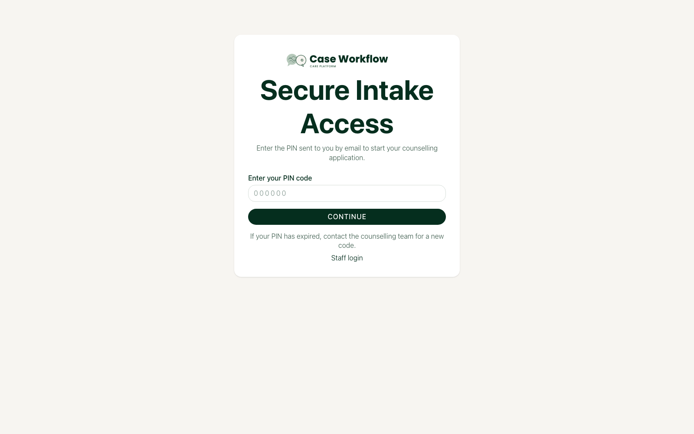
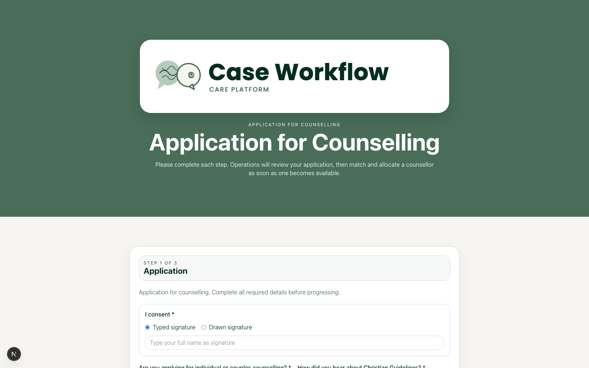
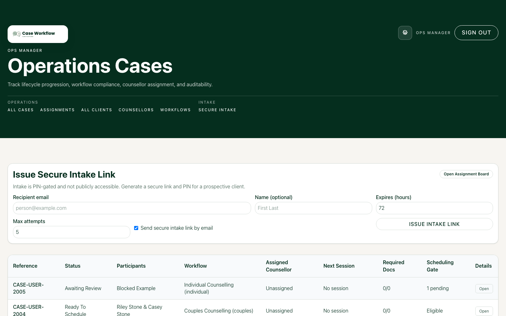
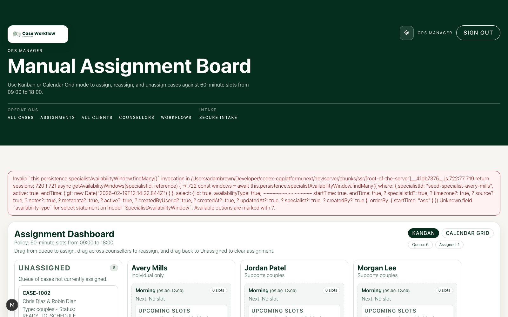
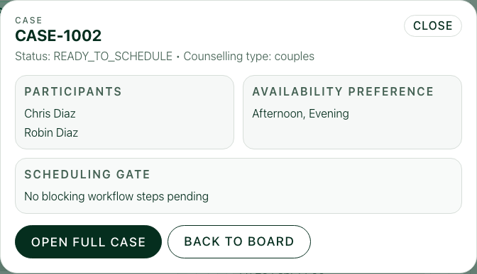
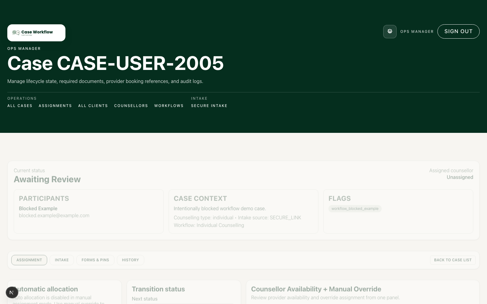
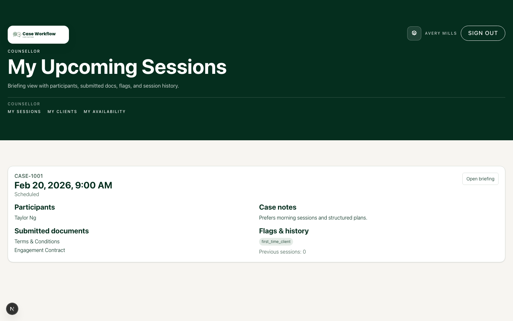
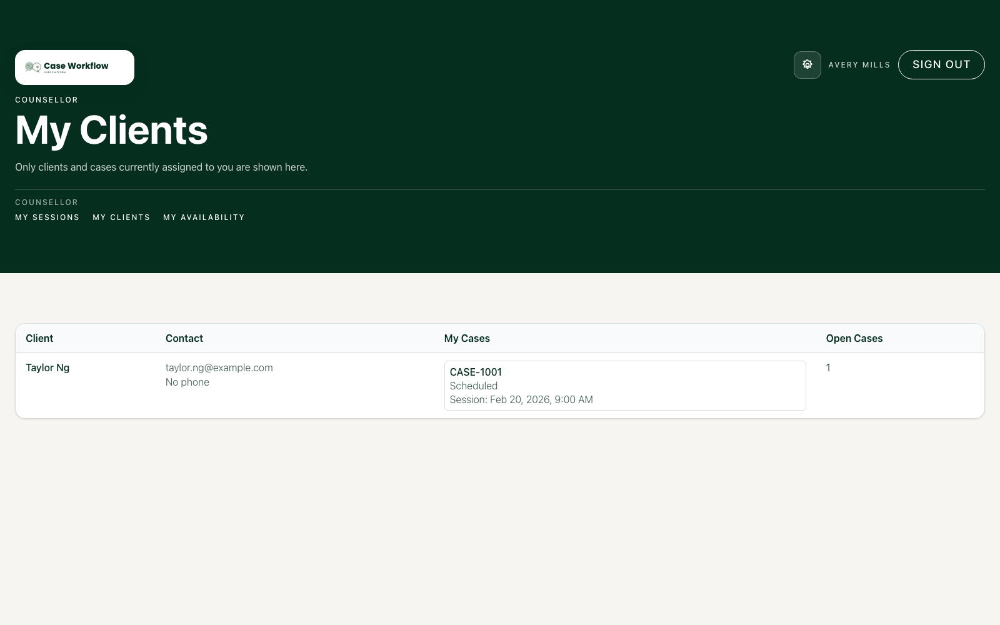
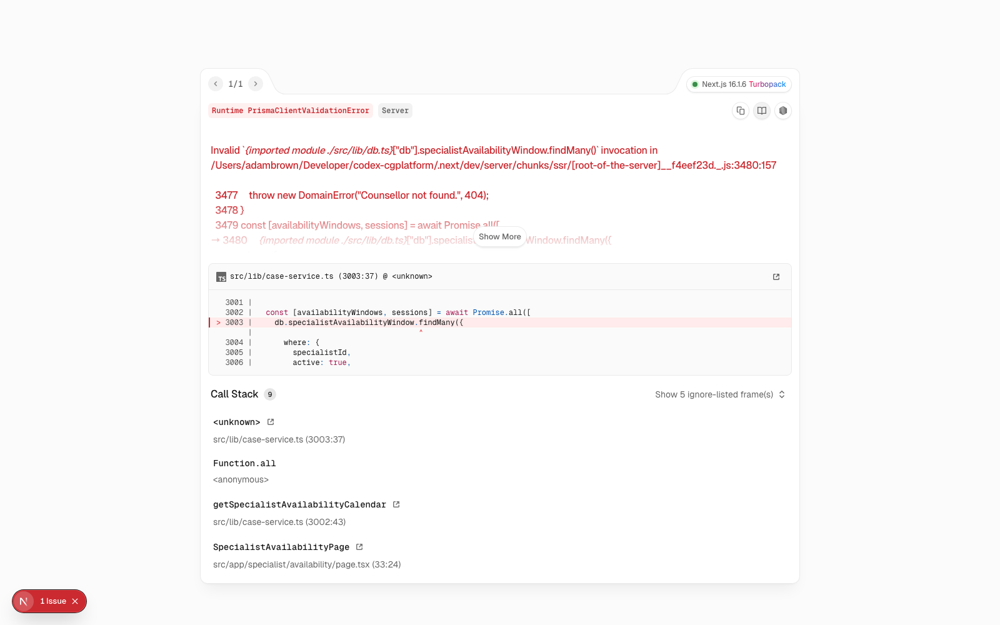

# Persona UI Screenshots

This document captures key UI stages for each persona using Playwright against seeded local data.

Related docs:

- [Documentation Home](./index.md)
- [Persona Overview](./personas.md)
- [Ops Manager Guide](./ops-manager.md)
- [Counsellor Guide](./counsellor.md)
- [End Client Guide](./end-client.md)

- Generated: 2026-02-19 (local)
- Base URL: `http://127.0.0.1:3001`
- Source manifest: `docs/screenshots/personas/manifest.json`

## Regenerate

1. Seed data:

```bash
npm run db:seed
```

2. Run app:

```bash
npm run dev
```

3. Capture:

```bash
PLAYWRIGHT_BASE_URL=http://127.0.0.1:3001 npm run screenshots:personas
```

## End Client Journey

### Secure intake PIN entry

Route: `/intake/access/seed-intake-primary-2001`



### Application for counselling (step 1)

Route: `/intake?accessKey=...`



## Ops Manager Journey

### Case list

Route: `/admin/cases`



### Assignment dashboard

Route: `/admin/assignments`



### Case modal from assignment dashboard

Route: `/admin/assignments` (case card click)



### Case detail

Route: `/admin/cases/:id`



## Counsellor Journey

### Upcoming sessions

Route: `/specialist/sessions`



### My clients

Route: `/specialist/clients`



### Availability calendar

Route: `/specialist/availability`


