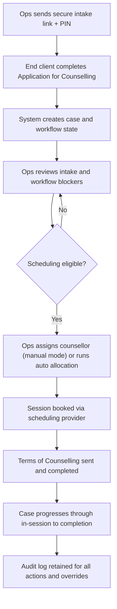

# CG Platform Documentation

This documentation is designed for GitHub Pages and focuses on three personas:

- Ops Manager
- Counsellor
- End Client

The product supports counselling case management with workflow-gated scheduling, secure intake, and role-scoped operations.

## Quick Links

- [Persona Overview](./personas.md)
- [Ops Manager Guide](./ops-manager.md)
- [Counsellor Guide](./counsellor.md)
- [End Client Guide](./end-client.md)
- [Functionality Reference](./functionality-reference.md)
- [Resend Setup Guide](./resend-setup.md)
- [Outlook Calendar Sync Setup](./outlook-calendar-sync-setup.md)
- [Persona Screenshots](./PERSONA_UI_SCREENSHOTS.md)
- [E2E Verification Report](./E2E_VERIFICATION_REPORT.md)

## High-Level Process

## GitHub Pages Setup

1. Open repository settings on GitHub.
2. Go to `Settings` -> `Pages`.
3. Under source, choose `Deploy from a branch`.
4. Select branch `main` and folder `/docs`.
5. Save.

After publish, this page becomes the documentation home.

